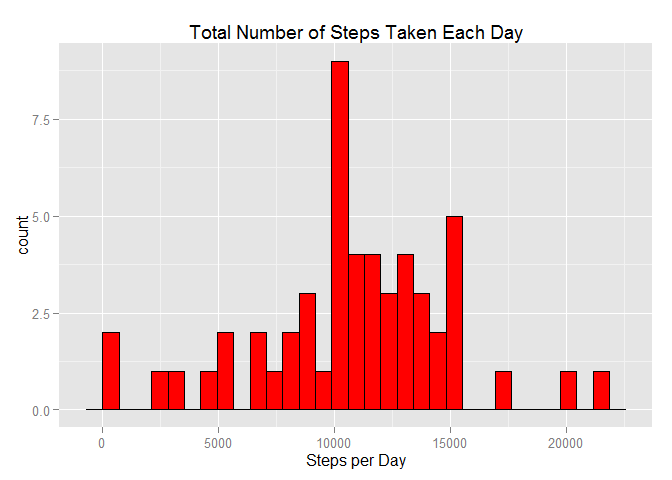
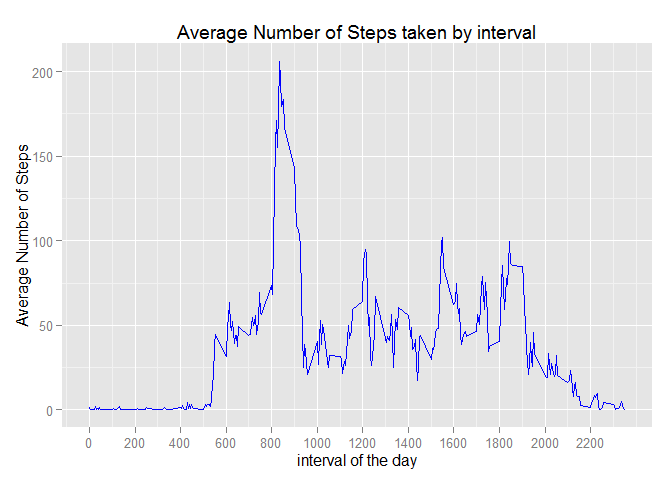
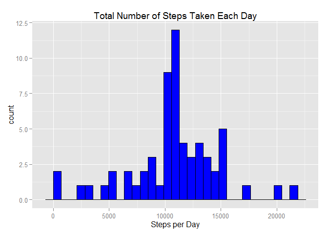
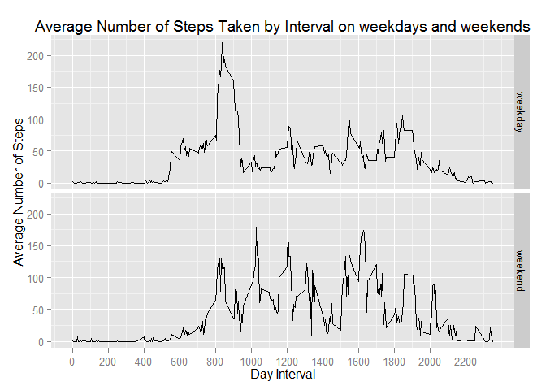

# Reproducible Research: Peer Assessment 1


##Data

This analysis makes use of data from a personal activity monitoring device. This device collects data at 5 minute intervals through out the day. The data consists of two months of data from an anonymous individual collected during the months of October and November, 2012 and include the number of steps taken in 5 minute intervals each day. The data for this analysis was downloaded from https://d396qusza40orc.cloudfront.net/repdata%2Fdata%2Factivity.zip in November 14th at 9 AM EST

After unzipping the file the csv file was extracted into a working directory.

## Variables in CSV file

1. steps: Number of steps taking in a 5-minute interval (missing values are coded as NA)
2. date: The date on which the measurement was taken in YYYY-MM-DD format
3. interval: Identifier for the 5-minute interval in which measurement was taken 

The dataset is stored in a comma-separated-value (CSV) file and there are a total of 17,568 observations in this dataset.

##Loading the data and transforming the date field


```r
data <- read.table(unz("activity.zip", "activity.csv"), header=T, quote="\"", sep=",", colClasses = c("numeric", "Date", "numeric"))

str(data)
```

```
## 'data.frame':	17568 obs. of  3 variables:
##  $ steps   : num  NA NA NA NA NA NA NA NA NA NA ...
##  $ date    : Date, format: "2012-10-01" "2012-10-01" ...
##  $ interval: num  0 5 10 15 20 25 30 35 40 45 ...
```

## What is mean total number of steps taken per day?


```r
library (dplyr)
```

```
## 
## Attaching package: 'dplyr'
## 
## The following objects are masked from 'package:stats':
## 
##     filter, lag
## 
## The following objects are masked from 'package:base':
## 
##     intersect, setdiff, setequal, union
```

```r
library (ggplot2)
groupby_day <- data %>% group_by(date)%>% summarize (totalSteps = sum (steps))
hplot <- ggplot(data = groupby_day, mapping = aes(x = totalSteps)) + geom_histogram(fill = "red",     colour = "black") + scale_x_continuous("Steps per Day") + 
     ggtitle("Total Number of Steps Taken Each Day")
hplot
```

```
## stat_bin: binwidth defaulted to range/30. Use 'binwidth = x' to adjust this.
```

 

On majority of days the steps taken are in the range 10000-15000.

##Calculate mean and median of steps per day


```r
day_mean <-mean(groupby_day$totalSteps, na.rm = TRUE)
```


```r
day_median <- median(groupby_day$totalSteps, na.rm = TRUE)
```
Mean 1.0766 &times; 10<sup>4</sup> is very close to median 1.0765 &times; 10<sup>4</sup>, however the distribution is not very uniform with outliers below 10,000 and above 15000 balancing out.

## What is the average daily activity pattern?

Lets make a time series plot (i.e. type = "l") of the 5-minute interval (x-axis) and the average number of steps taken, averaged across all days (y-axis)


```r
groupby_Interval <- data %>% group_by(interval)%>% summarize (avgSteps = mean (steps, na.rm = TRUE))
lplot <- ggplot(data = groupby_Interval, mapping = aes(x = interval, y= avgSteps)) + geom_line(colour = "blue") + scale_x_continuous("interval of the day", breaks = seq(min(groupby_Interval$interval), max(groupby_Interval$interval), 100)) + scale_y_continuous("Average Number of Steps") +  ggtitle("Average Number of Steps taken by interval")
lplot
```

 
 Lets find out Which 5-minute interval, on average across all the days in the dataset, contains the maximum number of steps.

```r
interval_MaxSteps <- filter (groupby_Interval, avgSteps == max(groupby_Interval$avgSteps) )
interval_MaxSteps
```

```
## Source: local data frame [1 x 2]
## 
##   interval avgSteps
## 1      835    206.2
```
 
 The interval 835 of the day is having largest number of steps on average i.e 206.1698
 
## Inputting missing values

lets calculate a the total number of missing values in the dataset (i.e. the total number of rows with NAs)


```r
sum(is.na(data$steps))
```

```
## [1] 2304
```
so total number of missing values in dataset are 2304.

Now, lets devise a strategy for filling in all of the missing values in the dataset. I am going to use the mean of that 5-minute interval to fill the missing value.


```r
# lets join original activity data with activity data grouped by Interval
data2 <- data %>% left_join(groupby_Interval, by = "interval")
#create a new column to fill missing values
data2$fillValues <- ifelse(is.na(data2$steps), data2$avgSteps, data2$steps)
# now drop columns steps and avgSteps
data2$steps <- NULL
data2$avgSteps <- NULL
#Rename fillValues as steps
colnames(data2) <- c("date", "interval", "steps")
#reorder columns as per original activity data
data2 <- data2[, c(3, 1, 2)]
```

Lets make a histogram of the total number of steps taken each day and Calculate and report the mean and median total number of steps taken per day


```r
groupby2_day <- data2 %>% group_by(date)%>% summarize (totalSteps2 = sum (steps))
hplot2 <- ggplot(data = groupby2_day, mapping = aes(x = totalSteps2)) + geom_histogram(fill = "blue",     colour = "black") + scale_x_continuous("Steps per Day") + 
     ggtitle("Total Number of Steps Taken Each Day")
hplot2
```

```
## stat_bin: binwidth defaulted to range/30. Use 'binwidth = x' to adjust this.
```

 


```r
day_mean2 <- mean(groupby2_day$totalSteps2)
```


```r
day_median2 <- median(groupby2_day$totalSteps2)
```
Lets compare the estimates after filling missing values vs original data set
1.  Mean # of steps for  Original data set - 1.0766 &times; 10<sup>4</sup>
2.  Mean # of steps after filling missing values - 1.0766 &times; 10<sup>4</sup>
3.  Median # of steps for  Original data set - 1.0765 &times; 10<sup>4</sup>
4.  Median # of steps after filling missing values - 1.0766 &times; 10<sup>4</sup>


## Are there differences in activity patterns between weekdays and weekends?

Lets create a new factor variable in the dataset with two levels - "weekday" and "weekend" indicating whether a given date is a weekday or weekend day.

```r
data2$dayType <- ifelse(weekdays(data2$date) %in% c("Satuday", "Sunday"), 
    "weekend", "weekday")
```

Group by interval and dayType and claculate Average number of steps


```r
groupby_IntervalDaytype <- data2 %>% group_by(interval, dayType) %>% summarise(avg2Steps = mean(steps))
```

```r
lplot_panel <- ggplot(data = groupby_IntervalDaytype, mapping = aes(x = interval, y = avg2Steps)) +  geom_line() + facet_grid(dayType ~ .) + scale_x_continuous("Day Interval" , 
    breaks = seq(min(groupby_IntervalDaytype$interval), max(groupby_IntervalDaytype$interval), 100)) + 
    scale_y_continuous("Average Number of Steps") + ggtitle("Average Number of Steps Taken by Interval on weekdays and weekends")
lplot_panel
```

 
There is a difference between weekdays and weekends. On weekdays, number of steps peak somewhere around 225 steps at 830 am where as on weekends peaks are seen around 175 steps at 10:15 am, 2:00 pm and 06:15 pm.
